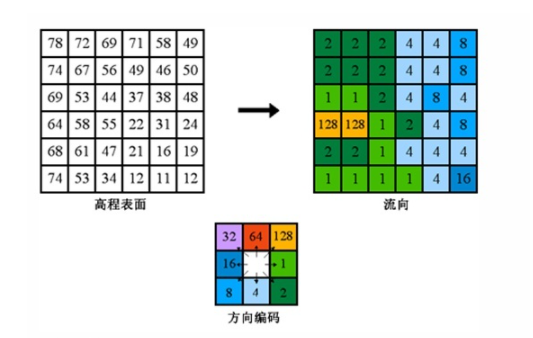

# 提取河流网络计算汇水区

D8算法是根据地形数据（DEM）提取该区域的汇水区，是地信领域里面的一个重要水文分析算法。

## 算法步骤

### 填充洼地

通过填充表面栅格中的汇来移除数据中的小缺陷。凹陷点是指未定义流域方向的像元；其周围的像元均高于它。倾泻点是相对于凹陷点的汇流区域高程最低的边界像元。如果凹陷点中充满了水，则水将从该点倾泻出去。假设一个凹陷点区域中倾泻点的高程为 210 英尺，凹陷点的最深点为 204 英尺（相差 6 英尺）。如果将 z 限制设置为 8，则会填充该特殊凹陷点。但是，如果将 z 限制设置为 4，则不会填充该凹陷点，因为该凹陷点的深度超过该限制值，将其视为有效凹陷点。

### 流向分析

创建从每个像元到其最陡下坡相邻点的流向的栅格。存在八个有效的输出方向，分别与流量可以流入的八个相邻像元相关。该方法通常被称为八方向 (D8) 流向建模，并且遵循在 Jenson 和 Domingue (1988) 中介绍的方法。

### 流量分析

创建每个像元累积流量的栅格。可选择性应用权重系数。流量工具可将累积流量计算为流入输出栅格中的每个下坡像元的所有像元的累积权重。如果未提供任何权重栅格，则将权重 1 应用到每个像元，并且输出栅格中的像元值是流入每个像元的像元数。高流量的输出像元是集中流动区域，可用于标识河道。流量为零的输出像元是局部地形高点，可用于识别山脊。

